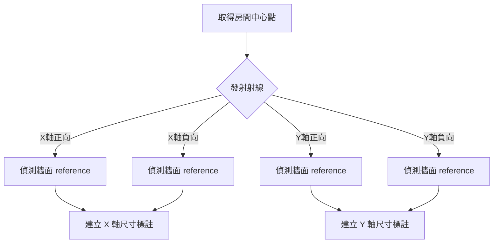

# 自動標註工作流程 (Ray-Casting)

## 📋 概述

本流程使用「射線偵測技術 (Ray-Casting)」從空間中心向外發射射線，偵測碰到的第一個實體（牆面、柱面），並抓取其幾何參考 (Reference) 來建立關聯性標註。

**核心目標：** 為機電專業 (MEP) 提供精確的空間淨尺寸（Net Clearance）。

## 🎯 適用場景

- **機電淨空間檢討**：標註設備放置空間的有效長寬。
- **走廊寬度檢查**：忽略裝飾材，直接標註結構或完成面淨寬。
- **防火避難分析**：驗證逃生通道的有效寬度。

## 🔧 核心邏輯



### 關鍵參數
*   **Origin**: 射線起點 (通常為 Room Location Point)。
*   **View**: 目標視圖 (必須是平面圖)。
*   **TargetCategory**: 偵測目標 (BuiltInCategory.OST_Walls)。

## 🔄 標準工作流程

### 步驟 1：取得房間資訊
取得房間的 `LocationPoint` 作為射線起點。

```javascript
const room = await execute('get_room_info', { roomId: 12345 });
const center = room.Location;
```

### 步驟 2：執行射線標註
分別對水平 (X) 與垂直 (Y) 方向執行標註。

```javascript
// X 軸向標註 (Horizontal)
execute('create_dimension_by_ray', {
    viewId: activeViewId,
    origin: center,
    direction: { x: 1, y: 0, z: 0 }, // 向右射線 (偵測右牆)
    counterDirection: { x: -1, y: 0, z: 0 } // 向左射線 (偵測左牆)
});

// Y 軸向標註 (Vertical)
execute('create_dimension_by_ray', {
    viewId: activeViewId,
    origin: center,
    direction: { x: 0, y: 1, z: 0 }, // 向上射線
    counterDirection: { x: 0, y: -1, z: 0 } // 向下射線
});
```

## ⚠️ 限制與注意事項

1.  **3D 視圖限制**：`ReferenceIntersector` 必須在 3D 視圖環境下運作（C# 內部處理），但尺寸標註必須建立在平面視圖。
2.  **遮擋問題**：如果房間中間有柱子擋住射線，會標註到柱子而非牆面（這通常也是機電想要的「淨空間」）。
3.  **邊界盒替代**：如果是 L 型或複雜多邊形房間，中心點射線可能打不到預期的牆，需改用「多點射線」或回退到邊界盒法。

---
**維護者：** RevitMCP Team
