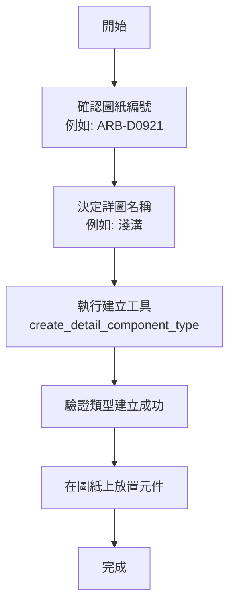
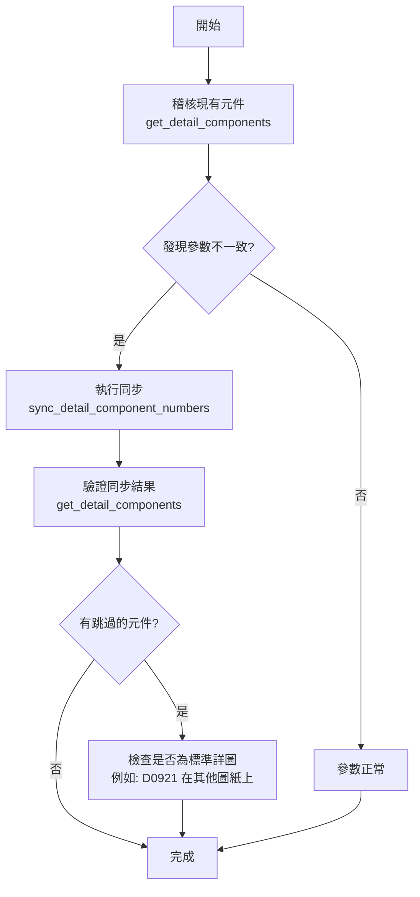

# 詳圖元件同步工作流程

## 📋 概述

本文檔說明如何使用 RevitMCP 工具管理 Revit 專案中的詳圖元件標頭（Detail Component Headers），包括查詢、建立類型、同步參數等操作。

**核心目標：** 確保詳圖標頭的「類型名稱」、「詳圖圖號」與「圖說名稱」參數與所在圖紙保持一致。

## 🎯 適用場景

- 新建詳圖標頭類型（手動精準控制）
- 批次同步詳圖標頭參數與圖紙編號
- 修正參數不一致的詳圖標頭
- 圖紙重編號後的參數更新

## 🔧 核心工具

### 1. get_detail_components
**用途：** 查詢專案中的詳圖元件

**輸入參數：**
```json
{
  "familyName": "AE-圖號"
}
```

**輸出格式：**
```json
{
  "Items": [
    {
      "ElementId": 9969446,
      "TypeName": "ARB-D0408-物流中心 外牆剖面圖一-鋼浪板屋頂",
      "FamilyName": "AE-圖號詳圖編號標頭-3.5mm",
      "SheetNumber": "ARB-D0408",
      "Parameters": {
        "詳圖圖號": "ARB-D0408",
        "圖說名稱": "物流中心 外牆剖面圖一"
      }
    }
  ]
}
```

**使用時機：**
- 稽核專案中所有詳圖標頭
- 檢查參數一致性
- 作為同步前的前置查詢

---

### 2. create_detail_component_type
**用途：** 手動建立新的詳圖標頭類型

**輸入參數：**
```json
{
  "sheetNumber": "ARB-D0921",
  "detailName": "淺溝"
}
```

**執行邏輯：**
1. 查詢圖紙 `ARB-D0921` 的名稱（例如：`物流中心 陰井、排水溝、淺溝、水箱人孔詳圖`）
2. 建構類型名稱：`ARB-D0921-物流中心 陰井、排水溝、淺溝、水箱人孔詳圖-淺溝`
3. 複製基礎類型（如 `D09XX`）
4. 設定類型參數：
   - `詳圖圖號` = `ARB-D0921`
   - `圖說名稱` = `物流中心 陰井、排水溝、淺溝、水箱人孔詳圖`
   - `詳圖名稱` = `淺溝`

**輸出格式：**
```json
{
  "Success": true,
  "TypeId": 123456,
  "TypeName": "ARB-D0921-物流中心 陰井、排水溝、淺溝、水箱人孔詳圖-淺溝",
  "Message": "成功建立詳圖元件類型"
}
```

**使用時機：**
- 需要為新圖紙建立專屬的詳圖標頭類型
- 精準控制類型命名與參數
- 避免自動建立產生的冗餘類型

> [!IMPORTANT]
> 此工具提供**手動精準控制**，是 v3.2 之後推薦的類型建立方式。

---

### 3. sync_detail_component_numbers
**用途：** 同步詳圖標頭參數與圖紙編號

**輸入參數：** 無

**執行邏輯（v3.5 Safeguard Mode）：**
1. 掃描所有圖紙及其視埠，建立「視圖 → 圖紙」對應表
2. 找出所有 `AE-圖號` 系列元件（支援 `OST_DetailComponents` 和 `OST_GenericAnnotation`）
3. 對每個元件：
   - 查詢其所在圖紙
   - **檢查類型名稱是否以該圖紙編號開頭**
   - 若匹配，更新 `詳圖圖號` 與 `圖說名稱` 參數
   - 若不匹配，**跳過**（保護標準/共用詳圖）

**輸出格式：**
```json
{
  "Success": true,
  "UpdatedInstances": 14,
  "TypesCreated": 0,
  "Message": "同步完成：更新了 14 個標頭元件，建立了 0 個新類型。"
}
```

**防護機制（v3.5 核心特性）：**
```
範例 1：匹配 → 更新
- 元件類型：ARB-D0408-物流中心 外牆剖面圖一-鋼浪板屋頂
- 所在圖紙：ARB-D0408
- 結果：✅ 更新參數

範例 2：不匹配 → 跳過
- 元件類型：ARB-D0921-物流中心 陰井、排水溝、淺溝、水箱人孔詳圖-淺溝
- 所在圖紙：AR-B-D02X2
- 結果：⏭️ 跳過（保護標準詳圖）
```

**使用時機：**
- 定期維護專案參數一致性
- 圖紙名稱變更後的批次更新
- 確保「圖紙編號已匹配」的元件參數正確

> [!WARNING]
> v3.5 **不會自動建立新類型**，也**不會自動更名類型**。若需新類型，請使用 `create_detail_component_type`。

---

## 📐 命名規範

### 類型名稱格式
```
{圖紙編號}-{圖紙名稱}-{詳圖名稱}

範例：
ARB-D0921-物流中心 陰井、排水溝、淺溝、水箱人孔詳圖-淺溝
│      │                                          │
圖紙編號  圖紙名稱                                    詳圖名稱
```

### 參數對應
| 參數名稱 | 來源 | 範例 |
|:--------|:-----|:-----|
| **詳圖圖號** | 圖紙編號 | `ARB-D0921` |
| **圖說名稱** | 圖紙名稱 | `物流中心 陰井、排水溝、淺溝、水箱人孔詳圖` |
| **詳圖名稱** | 使用者輸入 | `淺溝` |

---

## 🔄 標準工作流程

### 流程 1：新建詳圖標頭類型



**執行步驟：**
1. 確認目標圖紙編號（如 `ARB-D0921`）
2. 決定詳圖名稱（如 `淺溝`、`水溝`、`陰井`）
3. 使用 `create_detail_component_type` 建立類型
4. 在 Revit 中將新類型的元件放置到對應圖紙上

---

### 流程 2：批次同步參數



**執行步驟：**
1. 使用 `get_detail_components` 稽核所有詳圖標頭
2. 檢查參數是否與圖紙一致
3. 使用 `sync_detail_component_numbers` 批次同步
4. 驗證同步結果
5. 若有跳過的元件，確認是否為「標準詳圖被引用到其他圖紙」的正常情況

---

## 📚 版本演進歷史

### v1.0 - 初始版本（已廢棄）
- **方法：** Viewport-Based Approach
- **問題：** 無法處理直接放在圖紙上的元件

### v2.0 - Element-First Approach（已廢棄）
- **改進：** 從元件出發查詢所在圖紙
- **問題：** 參數映射不完整

### v3.0 - 正確參數映射
- **改進：** 修正參數對應邏輯
- **行為：** 自動建立新類型並同步

### v3.1 - 精準名稱解析
- **改進：** 
  - 修正 `ARB-D0214` 重複段落問題
  - 擴大掃描範圍（支援 `OST_GenericAnnotation`）

### v3.2 - Update-Only Mode ⭐
- **重大變更：** 只更新參數，不自動建立新類型
- **原因：** 避免產生冗餘類型
- **新增：** `create_detail_component_type` 工具（手動建立）

### v3.2.1 - Sheet-Level Instance Support
- **修正：** 支援直接放在圖紙上的元件

### v3.2.2 - Move-If-Exists Mode（已廢棄）
- **嘗試：** 自動切換到匹配的類型
- **問題：** 邏輯過於複雜

### v3.3 - Consistency Mode（已廢棄）
- **嘗試：** 智慧連動更名（圖紙重編號時自動更名類型）
- **嚴重問題：** 誤改標準/共用詳圖（如 `ARB-D0921` 被改為 `AR-B-D02X2`）

### v3.4 - 參數格式調整
- **調整：** 確認 `詳圖圖號` 使用完整格式（含 `ARB-` 前綴）

### v4.0 - Sequential Fuzzy Match ⭐⭐⭐⭐
- **重大變更：** 實作 `async/await` 順序執行機制，解決大規模寫入（>50 條指令）時的穩定性問題。
- **改進：** 加入強型態名稱正規化（Normalization），支援全半形轉換、自動移除括號與符號、自動排除 placeholder。
- **策略：** 當資產編號格式不一時（如 `ARB-D09001` vs `AR-B-D0901`），改以「前置 ID 提取」或「正規化名稱包含了」作為次要比對手段。
- **性能：** ✅ 已驗證，可穩定處理 100+ 個同時同步請求而不遺漏指令。

---

## ⚠️ 常見問題與解決方案

### Q1: 為什麼同步後有些元件沒有被更新？
**原因：** v3.5 的防護機制會跳過「類型名稱與圖紙編號不匹配」的元件。

**判斷方法：**
```
元件類型：ARB-D0921-物流中心 陰井、排水溝、淺溝、水箱人孔詳圖-淺溝
所在圖紙：AR-B-D02X2

類型名稱開頭：ARB-D0921
圖紙編號：AR-B-D02X2
結果：不匹配 → 跳過
```

**解決方案：**
- 若這是**標準詳圖被引用**：這是正常行為，無需處理
- 若需要更新：先使用 `create_detail_component_type` 為該圖紙建立專屬類型，然後手動切換元件類型

---

### Q2: 如何為新圖紙建立詳圖標頭？
**推薦流程：**
1. 使用 `create_detail_component_type` 建立專屬類型
2. 在 Revit 中放置該類型的元件到圖紙上
3. 執行 `sync_detail_component_numbers` 確保參數正確

**不推薦：** 直接複製其他圖紙的元件（會導致類型名稱不匹配）

---

### Q3: 圖紙重編號後如何更新詳圖標頭？
**情境：** 圖紙從 `ARB-D0930` 改為 `ARB-D0938`

**v3.5 行為：**
- 同步工具**不會自動更名類型**
- 類型名稱仍為 `ARB-D0930-...`
- 因為名稱不匹配，參數**不會被更新**

**解決方案：**
1. **手動更名類型**：在 Revit 中將類型名稱改為 `ARB-D0938-...`
2. **執行同步**：`sync_detail_component_numbers` 會更新參數
3. **或建立新類型**：使用 `create_detail_component_type` 建立 `ARB-D0938` 類型，手動切換元件

> [!NOTE]
> v3.5 刻意移除自動更名功能，以避免誤改標準詳圖。圖紙重編號需要手動介入。

---

### Q4: 什麼是「標準詳圖」？為什麼要保護它？
**標準詳圖定義：**
- 通用的詳圖類型（如 `ARB-D0921-淺溝`）
- 可以被多張圖紙引用
- 參數應保持與「原始圖紙」一致

**範例：**
```
ARB-D0921 圖紙：陰井、排水溝、淺溝、水箱人孔詳圖
- 包含 3 種詳圖：淺溝、水溝、陰井

AR-B-D02X2 圖紙：全棟高架車道剖面圖(2/2)
- 引用了 D0921 的「淺溝」詳圖（作為參考）
```

**若不保護會發生什麼：**
- `ARB-D0921-淺溝` 的參數會被錯誤更新為 `AR-B-D02X2`
- 原始 D0921 圖紙上的標頭也會顯示錯誤的編號

**v3.5 保護機制：**
- 偵測到類型名稱（`ARB-D0921`）與圖紙編號（`AR-B-D02X2`）不符
- 自動跳過，不更新參數

---

## 🎯 最佳實踐

### ✅ 推薦做法
1. **新圖紙**：使用 `create_detail_component_type` 建立專屬類型
2. **定期同步**：每週執行一次 `sync_detail_component_numbers`
3. **標準詳圖**：建立通用類型（如 `D09XX`），供多張圖紙引用
4. **命名規範**：嚴格遵循 `{圖紙編號}-{圖紙名稱}-{詳圖名稱}` 格式

### ❌ 避免做法
1. **不要**直接複製其他圖紙的詳圖標頭
2. **不要**手動修改參數（應透過同步工具維護）
3. **不要**期待同步工具自動建立新類型（v3.2 之後已移除）
4. **不要**期待同步工具自動更名類型（v3.5 已移除）

---

## 🔗 相關工作流程

- [圖紙與視埠管理](sheet-viewport-management.md) - 圖紙編號規範與管理
- [元素上色工作流程](element-coloring-workflow.md) - 視覺化相關操作

---

## 📝 開發建議

### 待實作功能
1. **batch_create_detail_types** - 批次建立多個詳圖類型
2. **validate_detail_consistency** - 驗證參數一致性報告
3. **migrate_detail_type** - 批次切換元件類型（圖紙重編號輔助）

### 改進方向
- 提供「圖紙重編號」專用模式（可選的自動更名）
- 支援詳圖標頭模板（預設參數配置）
- 自動偵測「孤兒類型」（無元件使用的類型）並清理

---

**最後更新：** 2026-04-02  
**當前版本：** v4.0 Sequential Fuzzy Match  
**維護者：** RevitMCP Team
