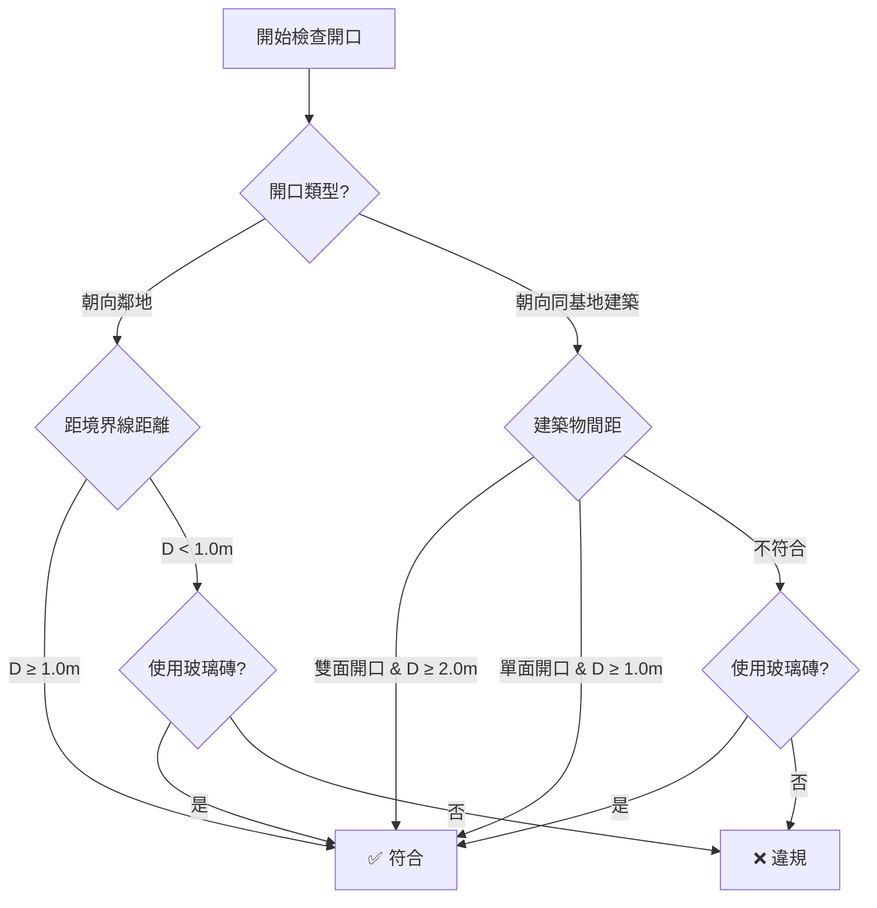
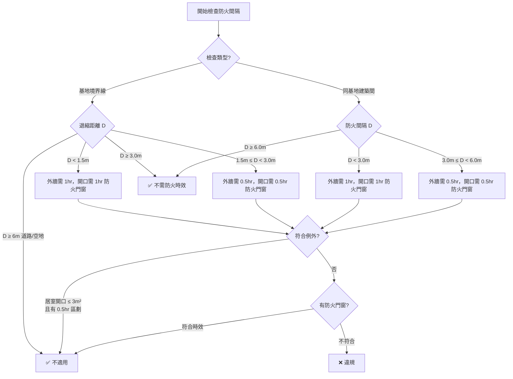

# 外牆開口檢討工作流程

> 依據台灣建築技術規則第45條、第110條進行外牆開口法規檢討

---

## 📋 法規依據

### 第45條：外牆開口與鄰地距離限制

| 情境 | 限制條件 | 例外規定 |
|:-----|:---------|:---------|
| **緊鄰鄰地** | 不得向鄰地方向開設門窗、開口及陽臺 | 外牆距境界線 ≥ 1.0m<br>或使用不透視固定玻璃磚 |
| **同一基地內建築物間** | 相對開口水平淨距離 ≥ 2.0m | 僅一面開設時 ≥ 1.0m<br>或使用不透視玻璃磚 |
| **門窗開啟** | 不得妨礙公共交通 | - |

### 第110條：防火間隔

**主要規定**：

#### 基地境界線退縮規定

| 退縮距離 | 外牆防火時效 | 開口防火設備 |
|:---------|:-------------|:-------------|
| **< 1.5m** | 1小時以上 | 同等防火時效之防火門窗 |
| **1.5m ~ 3.0m** | 半小時以上 | 同等防火時效之防火門窗 |
| **≥ 6m 道路/空地** | 不在此限 | - |

#### 同一基地內兩幢建築物間防火間隔

| 防火間隔 | 外牆防火時效 | 開口防火設備 |
|:---------|:-------------|:-------------|
| **< 3.0m** | 1小時以上 | 同等防火時效之防火門窗 |
| **3.0m ~ 6.0m** | 半小時以上 | 同等防火時效之防火門窗 |

#### 例外規定（免除防火時效）

**條件**（需同時滿足）：
1. 同一居室開口面積 ≤ 3.0 m²
2. 該居室以具半小時防火時效之牆壁與樓板區劃分隔（不含門窗）

**注意事項**：
- 防火間隔目的為阻隔火勢蔓延，非供平時通行
- 防火構造建築適用（鄰接≥6m道路或永久空地之側除外）
- 防火門窗應包含門窗扇、樘、五金、玻璃等完整組件

---

## 🔍 檢討項目

### 優先級分類

| 優先級 | 檢討項目 | 法規依據 |
|:------:|:---------|:---------|
| 🔴 **P1** | 緊鄰鄰地開口距離 | 第45條 |
| 🔴 **P1** | 同一基地建築物間距 | 第45條 |
| 🔴 **P1** | 基地境界線防火間隔 | 第110條 |
| 🔴 **P1** | 同基地建築間防火間隔 | 第110條 |
| 🟠 **P2** | 開口防火設備檢查 | 第110條 |
| 🟠 **P2** | 居室開口面積計算 | 第110條例外 |

---

## 🚀 檢討流程

### 階段 1：識別外牆與開口

#### 1.1 識別外牆
```yaml
目標: 找出所有面向基地邊界或鄰棟建築的外牆
Revit_API:
  - FilteredElementCollector: Wall
  - Location.Curve: 取得牆壁中心線
  - BoundingBox: 取得牆壁範圍
篩選條件:
  - Function == "Exterior" OR 位於基地邊界
  - IsStructural == true (視需求)
```

#### 1.2 識別開口
```yaml
目標: 找出外牆上的所有門窗開口
Revit_API:
  - FamilyInstance: Window 類別
  - FamilyInstance: Door 類別
  - Opening: 牆壁內建開口
  - HostId: 確認開口所屬牆壁
取得資訊:
  - 開口位置 (XYZ)
  - 開口尺寸 (Width, Height)
  - 開口面積
  - 開口朝向 (Normal Vector)
```

---

### 階段 2：計算鄰地/鄰棟距離

#### 2.1 定義基地邊界
```yaml
方法_A: 使用 Property Line
  Revit_API:
    - Site.Location.Curves
    - PropertyLine 元素
    
方法_B: 使用專案參數
  讀取: "基地範圍" 參數
  格式: Polyline 或 CurveArray
  
方法_C: 手動指定
  輸入: 基地邊界座標
```

#### 2.2 計算最短距離
```yaml
演算法:
  1. 取得開口中心點 P_opening
  2. 取得基地邊界線集合 L_boundary[]
  3. 計算 min(distance(P_opening, L_i)) for all L_i
  
Revit_API:
  - Line.Distance(XYZ point)
  - XYZ.DistanceTo()
  
單位: 公尺 (m)
```

#### 2.3 計算鄰棟距離
```yaml
目標: 計算同一基地內其他建築物的距離
演算法:
  1. 識別同一基地內所有建築物外牆
  2. 排除自身建築物
  3. 計算開口到其他建築物外牆的最短距離
  
考量:
  - 相對開口 (兩面都有開口)
  - 單面開口 (僅一側有開口)
```

---

### 階段 3：法規判定

#### 3.1 第45條判定邏輯



#### 3.2 第110條判定邏輯




---

## 📊 輸出格式

### 報表結構

```json
{
  "projectInfo": {
    "name": "專案名稱",
    "checkDate": "2026-01-13",
    "checkType": "外牆開口檢討"
  },
  "summary": {
    "totalWalls": 150,
    "totalOpenings": 320,
    "violations": 5,
    "warnings": 12,
    "passed": 303
  },
  "details": [
    {
      "openingId": "123456",
      "wallId": "654321",
      "openingType": "Window",
      "location": { "x": 1000.0, "y": 2000.0, "z": 500.0 },
      "area": 2.5,
      "checkResults": {
        "article45": {
          "status": "FAIL",
          "distance": 0.8,
          "required": 1.0,
          "message": "開口距境界線僅0.8m，不符合第45條規定"
        },
        "article42": {
          "status": "PASS",
          "effectiveArea": 2.0,
          "reductionFactor": 0.8
        }
      }
    }
  ]
}
```

### 視覺化輸出

#### 顏色標示規則
```yaml
Revit 元素上色:
  違規 (FAIL):
    顏色: RGB(255, 0, 0) 紅色
    模式: OverrideGraphicSettings
  警告 (WARNING):
    顏色: RGB(255, 165, 0) 橘色
  符合 (PASS):
    顏色: RGB(0, 255, 0) 綠色
  未檢查:
    保持原色
```

#### 標註距離
```yaml
建立 Dimension 標註:
  1. 開口中心 → 境界線 (最短距離)
  2. 顯示實際距離數值
  3. 附加法規要求數值
  範例: "實測: 0.8m (法規要求: ≥1.0m)"
```

---

## 🔧 Revit API 參考

### 核心類別與方法

| 功能 | Revit API | 說明 |
|:-----|:----------|:-----|
| **取得所有牆壁** | `FilteredElementCollector(doc)`<br>`.OfClass(typeof(Wall))` | 收集文件中所有牆壁 |
| **取得牆壁上的開口** | `wall.FindInserts(true, true, true, true)` | 找出牆壁上的門窗 |
| **取得開口資訊** | `FamilyInstance.Symbol`<br>`FamilyInstance.Location` | 取得類型與位置 |
| **建立開口** | `doc.NewOpening(wall, point1, point2)` | 建立矩形開口 |
| **取得 BoundingBox** | `element.get_BoundingBox(view)` | 取得元素範圍 |
| **計算距離** | `XYZ.DistanceTo(XYZ other)` | 計算兩點距離 |
| **覆寫圖形** | `OverrideGraphicSettings`<br>`view.SetElementOverrides(id, override)` | 設定元素顏色 |
| **建立標註** | `doc.Create.NewDimension(view, line, references)` | 建立尺寸標註 |

### Transaction 範例

```csharp
using (Transaction trans = new Transaction(doc, "外牆開口檢討"))
{
    trans.Start();
    try
    {
        // 執行檢討與視覺化
        OverrideGraphicSettings override = new OverrideGraphicSettings();
        override.SetProjectionLineColor(new Color(255, 0, 0));
        view.SetElementOverrides(openingId, override);
        
        trans.Commit();
    }
    catch (Exception ex)
    {
        trans.RollBack();
        TaskDialog.Show("錯誤", ex.Message);
    }
}
```

---

## ⚠️ 開發注意事項

### 1. 座標系統
- Revit 使用英呎 (feet) 為內部單位
- 輸出報表轉換為公尺 (m)：`value_feet * 0.3048`

### 2. 視圖依賴
- `BoundingBox` 需要指定 View
- 標註 `Dimension` 必須在平面視圖建立

### 3. 效能優化
- 使用 `FilteredElementCollector` 搭配 Filter
- 避免重複查詢相同元素
- 批次處理 Transaction

### 4. 錯誤處理
- 處理找不到基地邊界的情況
- 處理牆壁無開口的情況
- 處理房間未定義功能的情況

---

## 📝 使用範例

### 執行檢討腳本

```javascript
// Node.js MCP Server 呼叫範例
const result = await executeRevitCommand({
  command: "CheckExteriorWallOpenings",
  parameters: {
    checkArticle41: true,  // 檢查採光
    checkArticle42: true,  // 檢查有效採光
    checkArticle45: true,  // 檢查開口距離
    siteBoundary: [
      { x: 0, y: 0 },
      { x: 50, y: 0 },
      { x: 50, y: 30 },
      { x: 0, y: 30 }
    ],
    colorizeViolations: true,
    createDimensions: true,
    exportReport: true,
    reportPath: "D:\\Reports\\exterior_wall_check.json"
  }
});
```

---

## 🎯 經驗教訓（待補充）

> 此章節將在實作與測試後補充實際遇到的問題與解決方案

---

## 🔗 相關文件

- [`path-maintenance-qa.md`](path-maintenance-qa.md) - QA/QC 工作流程參考
- [`corridor-analysis-protocol.md`](corridor-analysis-protocol.md) - 走廊分析流程
- [`element-coloring-workflow.md`](element-coloring-workflow.md) - 元素上色流程

---

**建立日期**: 2026-01-13
**法規版本**: 建築技術規則 (最新版本)
**Revit 版本**: 2022-2024
