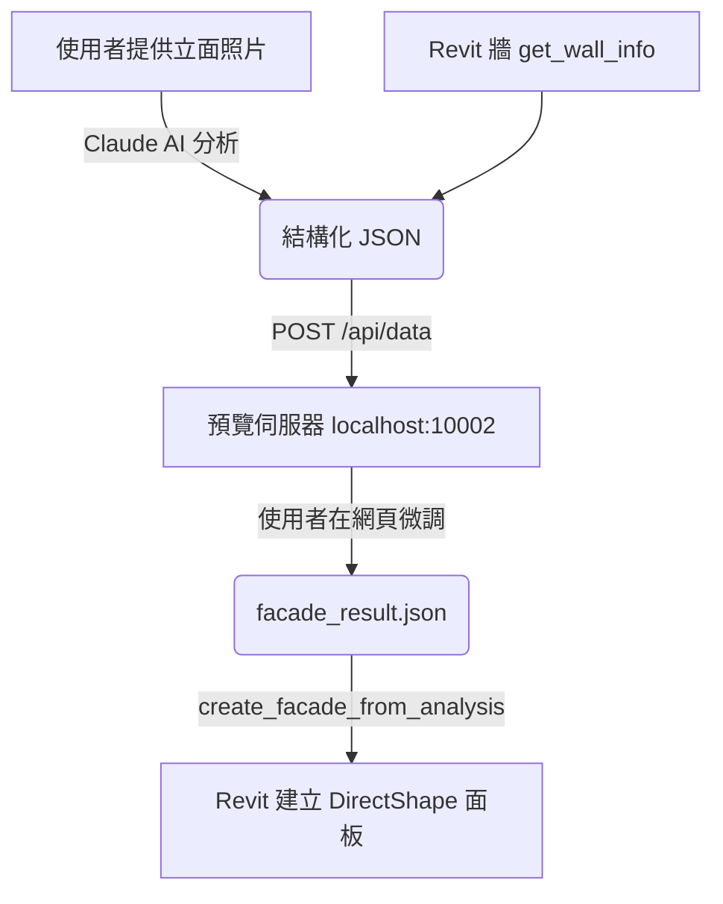

# 立面面板生成工作流程

## 概述

本工作流程允許使用者提供一張立面照片，由 AI 分析後透過網頁預覽工具微調參數，最終在 Revit 選定的牆上生成對應的立面。所有面板以 **DirectShape** 元素建立。

## 支援的立面幾何類型

| `geometryType` | 中文名 | 說明 | 典型案例 |
|----------------|--------|------|---------|
| `curved_panel` | 弧形面板 | 弧形截面沿垂直方向擠出 | 赤陶色凹弧外掛面板 |
| `beveled_opening` | 斜切凹窗框 | 厚牆上的金字塔形斜切開口 | 紅色方向性深凹窗 |
| `angled_panel` | 傾斜平板 | 平面面板繞軸傾斜 | 多色鋸齒形金屬面板 |
| `rounded_opening` | 圓角開口 | 厚牆上的圓角矩形/拱形開口 | 白色建築圓弧導角窗 |
| `flat_panel` | 平面面板 | 基礎矩形面板 | 一般外掛板 |

## 所需 MCP 工具

### 1. `get_wall_info`
取得選中牆的長度、高度、起終點座標，作為面板排列的基礎。

### 2. `create_facade_panel`
建立**單片**立面面板（DirectShape）。支援 5 種幾何類型。

**共用參數**：
- `wallId` — 目標牆 Element ID
- `geometryType` — 幾何類型
- `positionAlongWall` — 沿牆方向位置 (mm)
- `positionZ` — Z 高度 (mm)
- `width`, `height` — 面板/外框尺寸 (mm)
- `depth` — 深度 (mm)
- `thickness` — 板厚 (mm)
- `offset` — 距牆面偏移 (mm)
- `color` — HEX 顏色
- `name` — 名稱標識

**各類型專用參數**：
- `curved_panel`: `curveType` (concave/convex)
- `angled_panel`: `tiltAngle` (度), `tiltAxis` (horizontal/vertical)
- `beveled_opening`: `bevelDirection` (center/up/down/left/right), `openingWidth`, `openingHeight`
- `rounded_opening`: `cornerRadius` (mm), `openingShape` (rounded_rect/arch/stadium/rect), `openingWidth`, `openingHeight`

### 3. `create_facade_from_analysis`
**批次建立**整面立面，根據預覽工具輸出的 result JSON。

**輸入結構**：
```json
{
  "wallId": 123456,
  "facadeLayers": {
    "outer": {
      "offset": 200,
      "panelTypes": [
        {
          "id": "A",
          "name": "FP_Curved_Wide",
          "width": 800,
          "depth": 150,
          "thickness": 30,
          "curveType": "concave",
          "geometryType": "curved_panel",
          "color": "#B85C3A"
        }
      ],
      "pattern": ["ABABAB", "ABABAB", "ABABAB"],
      "gap": 20,
      "horizontalBandHeight": 200,
      "floorHeight": 3600
    }
  }
}
```

## 資料流



## 執行步驟

### 步驟 1：啟動預覽伺服器
```powershell
cd MCP-Server
node scripts/facade_preview_server.js
```
伺服器運行於 `http://localhost:10002`。

### 步驟 2：AI 分析照片
Claude 分析使用者提供的立面照片，識別：
- 立面類型（單層/雙層、幾何類型）
- 面板類型數量和參數（寬度、深度、曲線等）
- 排列模式和層數
- 色彩

### 步驟 3：推送資料到預覽伺服器
AI 將分析結果 + 牆體尺寸推送到預覽伺服器。

### 步驟 4：網頁預覽微調
使用者在 `http://localhost:10002` 進行：
- 調整面板參數（弧深、寬度、角度、圓角等）
- 調整排列模式（交替、成對、對稱、錯位等）
- 確認後點擊「確認套用」

### 步驟 5：套用到 Revit
AI 讀取 `facade_result.json`，呼叫 `create_facade_from_analysis`。

## 注意事項

1. **DirectShape 限制**：DirectShape 不是標準 Revit 族群，無法被排程表統計，但支援材料和圖形覆寫。
2. **效能考量**：大量面板時（>100 片），建立過程可能較慢。
3. **僅支援直線牆**：目前不支援弧形牆，後續可擴充。
4. **布林運算**：`beveled_opening` 和 `rounded_opening` 使用 `BooleanOperationsUtils`，幾何複雜度較高。

## 相關資源

| 檔案 | 說明 |
|------|------|
| `MCP/Core/CommandExecutor.cs` | C# 後端實作（CreateFacadePanel, CreateFacadeFromAnalysis, 5 種幾何方法） |
| `MCP-Server/src/tools/revit-tools.ts` | MCP 工具定義 |
| `MCP-Server/scripts/facade_preview_server.js` | 預覽伺服器 (port 10002) |
| `MCP-Server/scripts/facade_preview.html` | 網頁預覽工具 |
| `MCP-Server/scripts/facade_result.json` | 使用者確認後的設定結果 |
