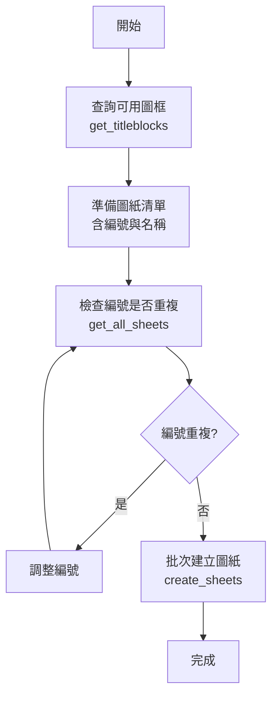
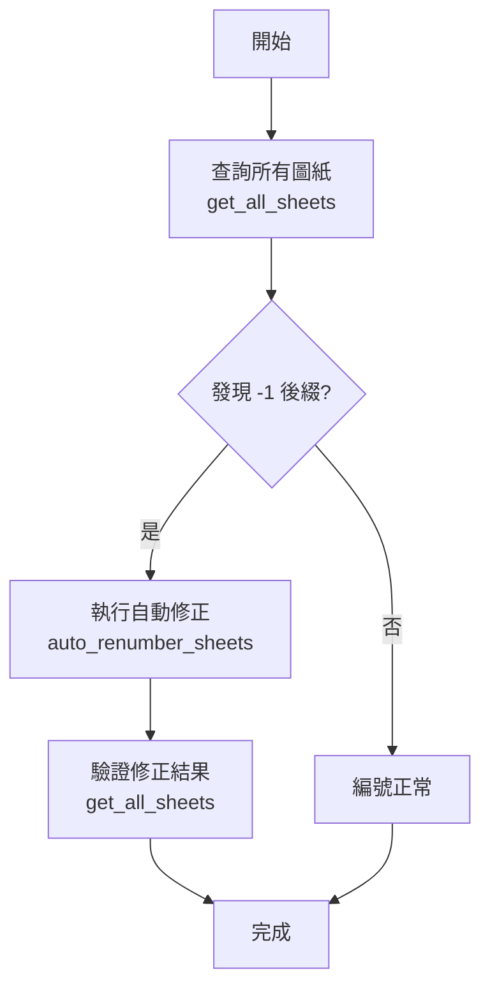

# 圖紙與視埠管理工作流程

## 📋 概述

本文檔說明如何使用 RevitMCP 工具管理 Revit 專案中的圖紙（Sheets）與視埠（Viewports），包括查詢、建立、編號管理等操作。

## 🎯 適用場景

- 批次建立圖紙
- 查詢專案中所有圖紙清單
- 管理圖紙編號規範
- 自動修正圖紙編號衝突
- 查詢視埠與圖紙的對應關係

## 🔧 核心工具

### 1. get_all_sheets
**用途：** 取得專案中所有圖紙清單

**輸入參數：** 無

**輸出格式：**
```json
{
  "Sheets": [
    {
      "Id": 123456,
      "Number": "ARB-D0408",
      "Name": "物流中心 外牆剖面圖一"
    }
  ]
}
```

**使用時機：**
- 需要稽核專案圖紙清單
- 檢查圖紙編號規範
- 作為其他工具的前置查詢

---

### 2. get_titleblocks
**用途：** 取得專案中所有可用的圖框類型

**輸入參數：** 無

**輸出格式：**
```json
{
  "TitleBlocks": [
    {
      "Id": 789012,
      "Name": "A1 橫式圖框",
      "FamilyName": "標準圖框"
    }
  ]
}
```

**使用時機：**
- 批次建立圖紙前，需先查詢可用圖框
- 確認專案中已載入的圖框類型

---

### 3. create_sheets
**用途：** 批次建立空白圖紙

**輸入參數：**
```json
{
  "titleBlockId": 789012,
  "sheets": [
    {
      "number": "ARB-D0501",
      "name": "一層平面圖"
    },
    {
      "number": "ARB-D0502",
      "name": "二層平面圖"
    }
  ]
}
```

**輸出格式：**
```json
{
  "CreatedSheets": [
    {
      "Id": 999001,
      "Number": "ARB-D0501",
      "Name": "一層平面圖"
    }
  ],
  "Message": "成功建立 2 張圖紙"
}
```

**注意事項：**
- 圖紙編號必須唯一，若重複會建立失敗
- 建議先使用 `get_all_sheets` 確認編號未被使用

---

### 4. auto_renumber_sheets
**用途：** 自動修正圖紙編號衝突（如 `-1` 後綴）與語意排序。

**執行邏輯：**
1. **衝突掃描**：識別帶有 `-1` 的圖紙，並計算主序列需移動的目標編號。
2. **語意排序 (OptimizeSheetOrder)**：
   - 根據括號語意（如 `(一)`, `(1)`, `(1/3)`）提取索引。
   - **分段機制**：僅在「連續目標編號」區間內進行排序。若相鄰目標編號差距 > 3，則視為不同群組，不予混合排序。
3. **兩階段執行 (Two-Pass Execution)**：
   - **第一階段**：將所有受影響圖紙改為暫時性名稱（如 `_TEMP_FIX_`），釋放原始編號空間。
   - **第二階段**：套用最終目標編號，確保不因衝突而報錯。

**範例 (分頁圖紙修正)：**
```
修正前：
- D0266 (1/3)
- D0267 (3/3)  ← 亂序
- D0268 (2/3)  ← 亂序

修正後：
- D0266 (1/3) 
- D0267 (2/3)  ← 正確
- D0268 (3/3)  ← 正確
```

**注意事項：**
- 相同名稱但位於不同區間的圖紙（如 D0258 與 D0274）不會被此工具交換。
- 支援中文與阿拉伯數字混合索引。

**使用時機：**
- 專案中出現大量 `-1` 後綴圖紙
- 需要整理圖紙編號順序
- 匯入外部圖紙後的編號清理

---

### 5. get_viewport_map
**用途：** 取得視埠與圖紙的對應關係

**輸入參數：** 無

**輸出格式：**
```json
{
  "SheetId": 5860813,
  "SheetNumber": "ARB-D0201",
  "SheetName": "物流中心 地下一層平面索引圖",
  "ViewportId": 5861052,
  "ViewId": 5860819,
  "ViewName": "物流中心地下一層平面圖(全棟)",
  "ViewType": "FloorPlan"
}
```

**使用時機：**
- 需要知道某個視圖被放置在哪張圖紙上
- 稽核視埠配置
- 作為詳圖元件同步的前置查詢

---

## 📐 圖紙編號規範建議

### 標準格式
```
[專業代碼]-[圖紙類別][流水號]

範例：
- ARB-D0408  (建築-詳圖-0408)
- ARS-A0101  (建築-平面圖-0101)
- STR-S0201  (結構-平面圖-0201)
```

### 編號原則
1. **專業代碼** (2-3碼)
   - `ARB` = 建築 (Architecture)
   - `STR` = 結構 (Structure)
   - `MEP` = 機電 (MEP)

2. **圖紙類別** (1碼)
   - `A` = 平面圖 (Plan)
   - `D` = 詳圖 (Detail)
   - `S` = 剖面圖 (Section)
   - `E` = 立面圖 (Elevation)

3. **流水號** (4碼)
   - 建議保留前導零 (如 `0408` 而非 `408`)
   - 便於排序與擴充

---

## 🔄 標準工作流程

### 流程 1：批次建立圖紙



**執行步驟：**
1. 使用 `get_titleblocks` 查詢可用圖框，記下 `titleBlockId`
2. 使用 `get_all_sheets` 確認現有圖紙編號
3. 準備圖紙清單（避免編號重複）
4. 使用 `create_sheets` 批次建立
5. 驗證建立結果

---

### 流程 2：圖紙編號清理



**執行步驟：**
1. 使用 `get_all_sheets` 稽核圖紙清單
2. 檢查是否有 `-1` 後綴的圖紙
3. 使用 `auto_renumber_sheets` 自動修正
4. 再次查詢確認修正結果

---

## ⚠️ 常見問題與解決方案

### Q1: 建立圖紙時出現「編號已存在」錯誤
**原因：** 圖紙編號重複

**解決方案：**
1. 使用 `get_all_sheets` 查詢現有編號
2. 調整新圖紙的編號
3. 或使用 `auto_renumber_sheets` 清理舊編號

---

### Q2: 如何找出某個視圖被放在哪張圖紙上？
**解決方案：**
目前需要透過 `sync_detail_component_numbers` 內部邏輯實作的 viewport 映射表。

**建議：** 未來可將此功能獨立為 `get_viewport_map` 工具。

---

### Q3: 圖紙編號順序混亂怎麼辦？
**解決方案：**
1. 使用 `get_all_sheets` 匯出清單
2. 在外部（如 Excel）整理編號規則
3. 使用 Revit 內建的「重新編號」功能
4. 或開發專用的批次重編號工具

---

## 🔗 相關工作流程

- [詳圖元件同步工作流程](detail-component-sync.md) - 使用視埠映射進行參數同步
- [元素上色工作流程](element-coloring-workflow.md) - 視圖相關的視覺化操作

---

## 📝 開發建議

### 待實作功能
1. **batch_rename_sheets** - 批次重新編號工具
2. **duplicate_sheet** - 複製圖紙（含視埠配置）
3. **place_view_on_sheet** - 將視圖放置到圖紙上

### 改進方向
- 支援圖紙編號格式驗證
- 自動偵測編號規範並建議下一個可用編號
- 圖紙模板管理（預設視埠配置）

---

**最後更新：** 2026-02-02  
**維護者：** RevitMCP Team
